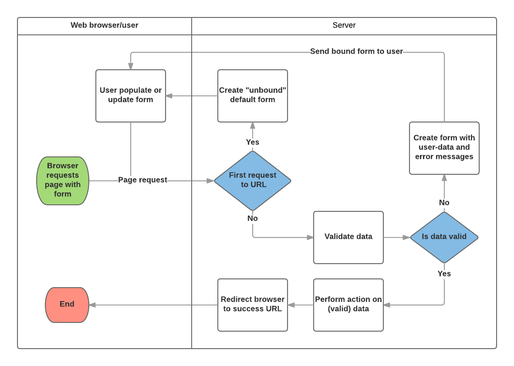

# Setup
## virtualenvwrapper
virtualenv using virtualenvwrapper
Allows you to manage virtual environments in one place.  
> for me it's in /User/Envs

Cmd:
- deactivate: exit out of venv
- workon: list all virtual env
- workon env_name: activate specified
- rmvirtualenv env_name: remove env

## django-admin
startproject project_name: create new website

Creates a folder and a subfolder with the project_name  
The subfolder is the entry point of the site(?)

- `__init__.py`: instruct python to treat dir as python package
- settings.py: site settings, including registering apps we create, location of static files, db config...
  - django uses sqlite by default
- urls.py: url to view mappings, often delegating to individual apps 
- wasgi.py: help django communicate with web server(?)
- asgi.py: provide asynchronous standard

## manage.py commands
python manage.py startapp app_name: creates new dir with admin, apps, models, tests, views files.  

Need to register in settings.py in INSTALLED_APPS:
```py
'catalog.apps.CatalogConfig',
```

## Other settings
Timezone: can change to KH, [list](https://en.wikipedia.org/wiki/List_of_tz_database_time_zones)

SECRET_KEY: used for security, must use .env in prod(?)
DEBUG: should set to false in prod, to not leak sensitive info

DATABASES: refer [here](https://docs.djangoproject.com/en/4.2/ref/settings/#databases)


## Url mapping
can include urls from an app inside the main urls.py
```py
path('catalog/', include('catalog.urls')),
```
> must have /catalog/urls.py 
> first url becomes the **base** of whatever's in /catalog/urls.py

## Db migrations
Whenever you make changes to the models, you need to run 2 commands:
- python manage.py makemigrations: create migrations for all apps 
  - can specify single app
- python manage.py migrate: apply changes to db 

## Test run
python manage.py runserver 


# Using models 
Think of what you want in a database instead of just fields of an object (Odoo exp).  
Selection lists can be models if change is needed.  

## Fields
Implemented as subclasses of `models.Model`

Can inherit other models, but then the database is fucked up.  

Order of the fields affect rendered form, though can be overidden. 

### Common args
- max_length: size of the type 
  - only on CharField(?)
- help_text: text lable of HTML form
  - can include <a>
- verbose_name: name for field, defaulted to capitalized version
- default: default value, can be value or object(?)
- null: bool, store `NULL` in db
- blank: bool, makes field optional 
  - often used with null=True to represent in db correctly 
  - either that or default(?)
- choices: select box options
- primary_key: bool, makes field pk
  - id field will be created if no pk 
  - default type of this field is in `AppNameConfig`

### Common Types 
- CharField: short-to-mid sized fixed length strings. Must specify `max_length`
- TextField: large arbitrary length strings. Can have `max_length` simply for display, db not affected. 
- IntegerField: validate whole int values. 
- DateField, DateTimeField: `date`, `datetime`
  - can set 
    - `auto_now`: bool, update field to current every time model is saved
    - `auto_now_add`: bool, set date when model was first created
- EmailField: store, validate email
- FileField, ImageField: upload files, images 
  - params to determine how and where uploaded files are stored
  - images have additional validation
- AutoField: auto incrementing int
- ForeignKey: many-to-one
- ManyToManyField: many-to-many relation
- OneToOneField: one-to-one, not present in Odoo oddly enough

[More fields](https://docs.djangoproject.com/en/4.2/ref/models/fields/#field-types) 4.0

### Metadata
Meta class inside each model  
ordering: list of field names  
access permissions: 
[more options](https://docs.djangoproject.com/en/4.2/ref/models/options/)
### Methods
should have `__str__` that returns str version of model  
`get_absolute_url` get model detail of what client sees  

## Model management
### Create
like laravel, just create object and call `save()` 
access field: obj.field

### Search
Model.objects
- .all(): all records
- .filter(query=value): where clause 
  ex: title__contains="wild"  
  filter fields of many-to-one record: genre__name__icontains="ficition"  
  can chain as many relationships as you'd like, i.e. type__cover__name__exact="hard"  
  [more on filters](https://docs.djangoproject.com/en/4.2/topics/db/queries/)
- .get(pk=value): one(?)
- .values(): turn result into dictionaries

[QuerySet api](https://docs.djangoproject.com/en/4.0/ref/models/querysets/)


# Django admin site
To see in admin, must register models in `admin.py`  
```py
admin.site.register(Genre)
admin.site.register(Language)
```

## Superuser
to login, user account must is_staff=True
`py manage.py createsuperuser`: user who has all access 

## Advanced config
Can change list view and detail view of each admin interface

```py
@admin.register(Book)
class BookAdmin(admin.ModelAdmin):
  pass
```

### List view
change what you see in list view, `list_display` tuple or list
```py
@admin.register(Book)
class BookAdmin(admin.ModelAdmin):
  list_display = ('title', 'author', 'display_genre')
```

**Display custom data with functions**: instead of using fields, you can use fn  
`Book` model:  
```py 
def display_genre(self):
  """Create string for genre in admin."""
  return ", ".join(genre.name for genre in self.genre.all()[:3])

display_genre.short_description = "Genre"
```
> i guess you do have to make a query get all related genres
> I question how performant it is. 

**List filters**: list what field you want to filter by, `list_filter`
```py
@admin.register(BookInstance)
class BookInstanceAdmin(admin.ModelAdmin):
  list_display = ('book', 'status', 'due_back', 'id')
  list_filter = ('status', 'due_back')
```

### Detail view
**Layout**: `fields`, tuple inside the list are laid horiontally
```py
@admin.register(Author)
class AuthorAdmin(admin.ModelAdmin):
  list_display = ('last_name', 'first_name', 'date_of_birth', 'date_of_death')

  fields = ['first_name', 'last_name', ('date_of_birth', 'date_of_death')]
```

**Sectioning**: `fieldsets`, can have section name or None
```py
@admin.register(BookInstance)
class BookInstanceAdmin(admin.ModelAdmin):
  list_display = ('book', 'status', 'due_back', 'id')
  list_filter = ('status', 'due_back')

  fieldsets = (
    (None, {
      'fields': ('book', 'imprint', 'id'),
    }),
    ('Availability', {
      'fields': ('status', 'due_back'),
    }),
  )
```

**Inline editing associated records**: for relations, can make them show up 
1. Create ModelInline that inherits from either `StackedInline` or `TabularInline`
2. use `inlines` in main Model
```py
class BookInstanceInline(admin.TabularInline): 
  model = BookInstance
  extra = 0


@admin.register(Book)
class BookAdmin(admin.ModelAdmin):
  list_display = ('title', 'author', 'display_genre')

  inlines = [BookInstanceInline]
```
> by default, 3 empty records are shown. Add `extra = 0` to remove those useless bastards.

See more in [admin site](https://docs.djangoproject.com/en/4.2/ref/contrib/admin/)

**Many to many field type**: can use the better widget via
```py
filter_horizontal = ('genre',)
```


# Creating our home page
## Url resources
- `catalog/` - home (index) page
- `catalog/books/` - a list of all books
- `catalog/authors/` - a list of all authors
- `catalog/book/<id>/` - detail view of a particular book
- `catalog/author/<id>/` - detail view of specific author
## Index
### Url mapping
since we addded `catalog/` to main `urls.py`, we can simply use `''` for index
*catalog/urls.py*
```py
urlpatterns = [
  path('', views.index, name='index'),
]
```
Names are useful for when we reference them. Any changes in the path will be reflected without changing template.
### View function-based
Functions that query database, render template and return HttpResponse. 
```py
def index(request):
  """View function for home page of site."""

  num_books = Book.objects.all().count()
  ...

  context = {
    'num_books': num_books,
    ...
  }

  return render(request, 'index.html', context=context)
```
`context` is how we pass data to the templates. 
### Template
`render()` will expect to find templates in `locallibary/catalog/templates`
#### Extending
Use blocks. Blocks can have defaults, or be empty for extending. 
> very easy to understand, more so than Laravel
#### Base template
Whatever we need: links, static, site structure. With one content block. 
[base_generic.html](./locallibrary/catalog/templates/base_generic.html)
#### Index template
Fills out the empty blocks, can override default ones. Extends base. 
[index.html](./locallibrary/catalog/templates/index.html)

To use data passed in via context, `{{ data_name }}`  
Extend, block:  
```html



  <title>Home page of Local Library</title>

```
### Referencing static files
Location for these files might change in dev vs. prod.  
Can use by specifying location relative to `STATIC_URL`. Need load static tag. 
```html

<link rel="stylesheet" href="" />
```
If STATIC_URL is 'static/', resulting url above will be http://127.0.0.1:8000/static/css/style.css  
Can clash names with different apps(?)
[read more](https://docs.djangoproject.com/en/4.2/howto/static-files/)
### Linking to Urls
```html
<li><a href="">Home</a></li>
```
### Where to find templates config
`TEMPLATES` in `settings.py`


# Generic list and detail views
using class-based views 
## Book list
list all books, name and author 
### Url mapping
```py
path('books/', views.BookListView.as_view(), name='books'),
```
> as_view() to create instance and handle the request
### View (class)
less code than manual function handler  
inherits from `generic.ListView`  
```py
class BookListView(generic.ListView):
  model = Book
  template_name = 'book_list.html'
```
Above handler will query all books and render with the provided template  
&emsp;template should be in app/templates/

**Change default behavior**: 
- context_obj_name: what the variable will be called in template
- queryset: what the queried list will contain
```py
context_object_name = 'book_list' 
queryset = Book.objects.filter(title__icontains='war')[:5]
```

**Overriding methods**: 
- get_queryset(): same as queryset but you can do more(?)
- get_context_data(): add more data to be sent to template
```py
def get_queryset(self):
  return Book.objects.filter(title__icontains='war')[:5]

def get_context_data(self, **kwargs):
  context = super(BookListView, self).get_context_data(**kwargs)
  context['some_data'] = 'This is just some data'
  return context
```
[Extend generic view](https://docs.djangoproject.com/en/4.2/topics/class-based-views/generic-display/)

### List view template
extend base, loop over books to display
```html



  <h1>Book List</h1>
  
    <ul>
      
        <li>
          <a href="{{ book.get_absolute_url }}">{{ book.title }}</a>
          ({{ book.author }})
        </li>
      
    </ul>
  
    <p>There are no books in the library.</p>
  

```
#### if
```py




```
#### for
```py



```
Or use if with loop
```html

  <ul>
    
    
  </ul>

  <p>There are no books in the library.</p>

```
[More template tags](https://docs.djangoproject.com/en/4.2/ref/templates/builtins/)
#### Variable access
With each obj of a model, we have access to all its attributes. Including properties and methods!!! 

## Book detail
have id 
### Url mapping
syntax `<something>`
**generic class expects a parameter named `pk`**
```py
path('book/<int:pk>', views.BookDetailView.as_view(), name='book-detail'),
```
[Converters](https://docs.djangoproject.com/en/4.2/topics/http/urls/#path-converters): 
- str
- int 
- slug
- uuid
- path: any non-empty str, matches complete url path (with /)

#### Advanced path matching/regular expr
`re_path()`
```py
re_path(r'^book/(?P<pk>\d+)$', views.BookDetailView.as_view(), name='book-detail'),
```
symbol         | meaning
---------------|------------------------------------------------------
^              | match beginning of text
&              | match end of text
\d             | match digit (0-9)
\w             | match word
+              | one of more of the preceding char
*              | zero of more of the preceding char
()             | capture pattern inside
(?P\<name>...) | capture pattern, put value in name to pass to handler
[]             | match against one char in set(?)

> captured values are always string

Examples:
- r'^book/(?P<pk>\d+)$' : /book/1234
- r'^book/(\d+)$' : /book/1234, but pass '1234' as unnamed
- r'^book/(?P<stub>[-\w]+)$' : /book/the-secret-garden
  has one or more chars that are either '-' or word

#### Additional options in url map
```py
path('myurl/<fish>', views.my_view, {'my_template_name': 'some_path'}, name='aurl'),
```
### View (class)
```py
class BookDetailView(generic.DetailView):
  model = Book
  template_name = 'book_detail.html'
```
**Function-based example**: 
```py
def book_detail_view(request, primary_key):
  try:
    book = Book.objects.get(pk=primary_key)
  except Book.DoesNotExist:
    raise Http404('Book does not exist')

  return render(request, 'catalog/book_detail.html', context={'book': book})
```
OR 
```py
from django.shortcuts import get_object_or_404

def book_detail_view(request, primary_key):
  book = get_object_or_404(Book, pk=primary_key)
  return render(request, 'catalog/book_detail.html', context={'book': book})
```
### Detail view template
genre is many-to-many so we can pipe to `|join:", "` to display genre names
```html



  <h1>Title: {{ book.title }}</h1>

  <p><strong>Author:</strong> <a href="{{ book.author.get_absolute_url }}">{{ book.author }}</a></p>
  <p><strong>Summary:</strong> {{ book.summary|linebreaksbr }}</p>
  <p><strong>ISBN:</strong> {{ book.isbn }}</p>
  <p><strong>Language:</strong> {{ book.language }}</p>
  <p><strong>Genre:</strong> {{ book.genre.all|join:", " }}</p>

  <div style="margin-left: 20px;margin-top: 20px;">
    <h4>Copies</h4>
    
      <hr>
      <p class="
        
          text-success
        
          text-danger
        
          text-warning
        "
      >
        {{ copy.get_status_display }}
      </p>

      
        <p><strong>Due to be returned:</strong> {{ copy.due_back }}</p>
      

      <p><strong>Imprint:</strong> {{ copy.imprint }}</p>
      <p class="text-muted"><strong>Id:</strong> {{ copy.id }}</p>
    
      <p>No copies to display.</p>
    
  </div>

```

**Generated one-to-many function**: bookinstance has one-to-many relation with book  
We can access book instances via `book.bookinstance_set.all`  function
Syntax: `_set`, e.g. `Book` has `bookinstance_set()`
```py

```
[Related objects](https://docs.djangoproject.com/en/4.2/topics/db/queries/#related-objects)
**Choices field function**: to get full name of selection field
```py
{{ copy.get_status_display }}
```

Other helpful pipes: 
- join:", "
- linebreaksbr
- default:value
- truncatewords:int

## Pagination
easier to do in class-based views
### View (class)
add `paginate_by`
```py
class BookListView(generic.ListView):
  model = Book
  template_name = 'book_list.html'
  paginate_by = 10
```
works via GET parameters `/catalog/books/?page=2`
### Template
add the previous and next links  
add pagination block in [base](./catalog/templates/base_generic.html), right after content block ends
```html

        

  
    <div class="pagination">
      <span class="page-links">
        
          <a href="{{ request.path }}?page={{ page_obj.previous_page_number }}">previous</a>
        

        <span class="page_current">
          Page {{ page_obj.number }} of {{ page_obj.paginator.num_pages }}
        </span>

        
          <a href="{{ request.path }}?page={{ page_obj.next_page_number }}">next</a>
        
      </span>
    </div>
  

```
- `page_obj` is instance of `Paginator`
- `request` exists in template(?)


# Sessions framework
set, get arbitrary data on per-site-visitor basis  
## What are sessions?
What: mechanism for keeping track of "state" between site and particular browser.  
How: place cookie in browser containing *session_id*, django uses that id to get session data stored in site database.  
## Enable sessions
`settings.py`
```py
INSTALLED_APPS = [
  # …
  'django.contrib.sessions',
  # …

MIDDLEWARE = [
  # …
  'django.contrib.sessions.middleware.SessionMiddleware',
  # …
```
## Using sessions
access via `request.session`, it's a dict
```py
my_car = request.session['my_car']
my_car = request.session.get('my_car', 'mini')
request.session['my_car'] = 'mini'
del request.session['my_car']
```
> api include set, check expiry date, clear expired sessions from data store
[Session docs](https://docs.djangoproject.com/en/4.2/topics/http/sessions/)
## Save session data 
django only save session to db when it's modified or deleted.  
It doesn't save when updating nested data, so you can use `request.session.modified=True`
> OR you can force session save on every request via adding to `settings.py`, `SESSION_SAVE_EVERY_REQUEST=True`.  

## Visit count
get, set
```py
num_visits = request.session.get('num_visits', 0)
request.session['num_visits'] = num_visits + 1

context = {
  ...
  'num_visits': num_visits,
}
```
display in index page
```html
<p>
  You have visited this page {{ num_visits }} time{{ num_visits|pluralize }}.
</p>
```


# User auth & permissions
django has built-in `Users` and `Groups`  
> it's very generic, so use 3rd party libs for advanced, e.g. throttling attempts, oauth  

Can build urls, forms, views, templates yourself or use stock. This tutorial uses stock.  

## Enable authentication 
like sessions, enable in `settings.py`
```py
'django.contrib.auth',
'django.contrib.contenttypes',

'django.contrib.auth.middleware.AuthenticationMiddleware',
```

## Create users & groups
superman/super123123
### Custom user
In order to extend `User` model, you must create your own custom one.  
**This must be done in 001_initial migration when starting project.** Because other tables depend on `User`.  

## Setup auth views
url mapping, views and forms have defaults, we need to provide templates
### Url 
Add to `urls.py`
```py
path('accounts/', include('django.contrib.auth.urls')),
```
Leads to following: 
```
accounts/ login/ [name='login']
accounts/ logout/ [name='logout']
accounts/ password_change/ [name='password_change']
accounts/ password_change/done/ [name='password_change_done']
accounts/ password_reset/ [name='password_reset']
accounts/ password_reset/done/ [name='password_reset_done']
accounts/ reset/<uidb64>/<token>/ [name='password_reset_confirm']
accounts/ reset/done/ [name='password_reset_complete']
```

### Template dir
In project root, `templates/registration/`, *not in app*
Must also add template path in `settings.py`
```py
import os

TEMPLATES = [
  {
    # …
    'DIRS': [os.path.join(BASE_DIR, 'templates')],
    'APP_DIRS': True,
    # …
```
### Login template
this uses django form handling code, discussed in next section  
I have so many questions.  
```html



  
    <p>Your username and password didn't match. Please try again.</p>
  

  
    
      <p>Your account doesn't have access to this page. To proceed, please login with an account that has access.</p>
    
      <p>Please login to see this page.</p>
    
  

  <form method="post" action="">
    
    <table>
      <tr>
        <td>{{ form.username.label_tag }}</td>
        <td>{{ form.username }}</td>
      </tr>
      <tr>
        <td>{{ form.password.label_tag }}</td>
        <td>{{ form.password }}</td>
      </tr>
    </table>

    <input type="submit" value="login">
    <input type="hidden" name="next" value="{{ next }}">
  </form>

  <p><a href="">Lost password?</a></p>

```

After successful login, django will redirect user to `/accounts/profile` by default.  
Can prevent this by adding in `settings.py`, `LOGIN_REDIRECT_URL = '/'`

### Logout template
if you go to `/accounts/logout`, user will be redirected to admin logout page.  
Adding logged_out.html template will change that for some reason(?).  

### Password reset template
`password_reset_form.html`, form to allow user to enter email change password
```html

```
#### Reset done
`password_reset_done.html`, show after user entered email
```html

```
#### Password reset email
`password_reset_email.html`, template for the reset email
```html
Someone asked for password reset for email {{ email }}. Follow the link below: 
{{ protocol }}://{{ domain }}
```
#### Password reset confirm
`password_reset_confirm.html`, form to enter new password
```html
```
#### Password reset complete
`password_reset_complete.html`, after reset is successful
```html
```

This tutorial doesn't cover email, so what was the point of me learning this???


## Show stuff to authenticated users
`{{ user }}` is passed to each template  
has other methods:  
- is_authenticated: 
- get_username: 

### Testing in templates  
Sidebar changes: 
```html
<ul class="sidebar-nav">
  …
  
    <li>User: {{ user.get_username }}</li>
    <li><a href="?next={{ request.path }}">Logout</a></li>
  
    <li><a href="?next={{ request.path }}">Login</a></li>
  
</ul>
```
`next` allows us to keep track of where to send users after they login/logout.  

### Testing in views
either your `@login_required` decorator or `request.user.is_authenticated`  
for class-based, can use `LoginRequiredMixin`  
- login_url: url to login form
- redirect: where to redirect to after login, override `next`

### Listing borrowed books
If no custom User, can import User.  
Add borrower to BookInstance and is_overdue property.  
```py
borrower = models.ForeignKey(User, on_delete=models.SET_NULL, null=True, blank=True)

@property
def is_overdue(self):
  """Determines if the book is overdue based on due date and current date."""
  return bool(self.due_back and date.today() > self.due_back)
```
View
```py
class LoanedBooksByUserListView(LoginRequiredMixin, generic.ListView):
  """Generic class-based view listing books on loan to current user."""
  model = BookInstance
  template_name = 'bookinstance_list_borrowed_user.html'
  paginate_by = 10

  def get_queryset(self):
    return (
      BookInstance.objects.filter(borrower=self.request.user)
        .filter(status__exact='o')
        .order_by('due_back')
    )
```
Url
```py
path('mybooks/', views.LoanedBooksByUserListView.as_view(), name='my-borrowed'),
```
Template
```py



  <h1>Borrowed books</h1>

  
    <ul>
      
        <li class="text-danger">
          <a href="">{{ bookinst.book.title }}</a>
          ({{ bookinst.due_back }})
        </li>
      
    </ul>

  
    <p>There are no books borrowed.</p>
  

```

### Permissions
Can test add, change delete permissions on whole model, or on model instances (row-level?).  

**Define permissions in Model**: in Meta of models
```py
class BookInstance(models.Model):
  # …
  class Meta:
    # …
    permissions = (("can_mark_returned", "Set book as returned"),)
```
Need to makemigrations and migrate again after creating permissions.  

**Template**: {{ perms }} to check if user has specific permissions 
```html

  <!-- We can mark a BookInstance as returned. -->
  <!-- Perhaps add code to link to a "book return" view here. -->

```
**View**: use `@permission_required('app.permission')` or `PermissionRequiredMixin`
```py
from django.contrib.auth.decorators import permission_required

@permission_required('catalog.can_mark_returned')
@permission_required('catalog.can_edit')
def my_view(request):
  # …
```
```py
from django.contrib.auth.mixins import PermissionRequiredMixin

class MyView(PermissionRequiredMixin, View):
  permission_required = 'catalog.can_mark_returned'
  # Or multiple permissions
  permission_required = ('catalog.can_mark_returned', 'catalog.can_edit')
  # Note that 'catalog.can_edit' is just an example
  # the catalog application doesn't have such permission!
```

Decorator will rediect to login if no permission. Add this to return 403
```py
@login_required
@permission_required('catalog.can_mark_returned', raise_exception=True)
```

Note to self: when changing the name of a migrated permission, it just creates a new record of the fucking thing. Despite me deleting from the db.  

Whatever the functionality is, it needs 3 things: Url, View and Template. Of course, the Model is needed to persist data too.  
And of course, without rendering the link, how can users access it?  


# Working with forms
create, update, delete using our own forms rather than admin page
## Django form handling process

`Form` class, simplies form generation and data cleaning & validation. 

## Renew-book using `Form` and function view
Very flexible as we can add whatever fields and whatever validation we like.  

Create form: `app/forms.py`
```py
from django import forms

class RenewBookForm(forms.Form):
  renewal_date = forms.DateField(help_text="Enter a date between now and 4 weeks (default 3).")
```
> DateField rendered with default widget: `DateInput`

Fields:
- BooleanField:
- CharField:
- ChoiceField:
- TypedChoiceField:
- DateField:
- DecimalField:
- DurationField:
- EmailField:
- FileField:
- FilePathField:
- FloatField:
- ImageField:
- IntegerField:
- GenericIPAddressField:
- MultipleChoiceField:
- TypedMultipleChoiceField:
- NullBooleanField:
- RegexField:
- SlugField:
- TimeField:
- UrlField:
- UUIDField:
- ComboField:
- MultiValueField:
- SplitDateTimeField:
- ModelMultipleChoiceField:
- ModelChoiceField:

Common field arguments:
- required: True by default
- label: HTML label, captalize field name & replace _ with space by default
- label_suffix: ':' display by default
- initial: initial value
- widget: widget to use, JS?
- help_text: 
- error_messages: list of error messages for the field
- validators: list of functions to call to validate field(?)
- localize: localization of form input data
- disabled: displayed but its value cannot be edited

Validation: one way is to override `clean_<fieldname>()`
```py
import datetime
from django import forms
from django.core.exceptions import ValidationError
from django.utils.translation import gettext_lazy as _


class RenewBookForm(forms.Form):
  renewal_date = forms.DateField(help_text="Enter a date between now and 4 weeks (default 3).")

  def clean_renewal_date(self):
    data = self.cleaned_data['renewal_date']

    if data < datetime.date.today():
      raise ValidationError(_('Invalid date - renewal in past'))
    
    if data > datetime.date.today() + datetime.timedelta(weeks=4):
      raise ValidationError(_('Invalid date - renewal more than 4 weeks ahead'))
    
    return data
```
More on [validation](https://docs.djangoproject.com/en/4.2/ref/forms/validation/)  
[Validate dependent fields](https://docs.djangoproject.com/en/4.2/ref/forms/validation/#validating-fields-with-clean)  

Url:
```py
path('book/<uuid:pk>/renew/', views.renew_book_librarian, name='renew-book-librarian'),
```
View: handle post and get in one function
```py
@login_required
@permission_required('catalog.can_mark_returned', raise_exception=True)
def renew_book_librarian(request, pk): 
  book_instance = get_object_or_404(BookInstance, pk)

  if request.method == 'POST':
    form = RenewBookForm(request.POST)
    if form.is_valid():
      book_instance.due_back = form.cleaned_data['renewal_date']
      book_instance.save()

      return HttpResponseRedirect(reverse('all-borrowed'))
  else:
    proposed_renewal_date = datetime.date.today() + datetime.timedelta(weeks=3)
    form = RenewBookForm(initial={'renewal_date': proposed_renewal_date})

  context = {
    'form': form,
    'book_instance': book_instance,
  }

  return render(request, 'book_renew_librarian.html', context)
```
Template: `book_renew_librarian.html`
```html



  <h1>Renew: {{ book_instance.book.title }}</h1>
  <p>Borrower: {{ book_instance.borrower }}</p>
  <p class="text-danger">
    Due date: {{ book_instance.due_back }}
  </p>

  <form action="" method="post">
    
    <table>
      {{ form.as_table }}
    </table>
    
    <input type="submit" value="Submit">
  </form>

```
> `form.as_table` renders the form as tr>td, there are other ways to render form

*Other ways to use form template variable*: 
Render whole form:
- .as_ul:
- .as_p:

[Render fields manually](https://docs.djangoproject.com/en/4.2/topics/forms/#rendering-fields-manually): form.fieldname.~
- .errors
- .id_for_label
- .help_text

Add renew link: `bookinstance_list_all_borrowed.html`
```html
- <a href="">Renew</a> 
```

## `ModelForms`
map form to single model, use Meta class to add options  
Add dictionaries to change defaults provided by models  
```py
class RenewBookModelForm(forms.ModelForm):
  def clean_due_back(self):
    data = self.cleaned_data['renewal_date']

    if data < datetime.date.today():
      raise ValidationError(_('Invalid date - renewal in past'))
    
    if data > datetime.date.today() + datetime.timedelta(weeks=4):
      raise ValidationError(_('Invalid date - renewal more than 4 weeks ahead'))
    
    return data


  class Meta:
    model = BookInstance
    fields = ['due_back']
    labels = {'due_back': _('Renewal date')}
    help_texts = {'due_back': _('Enter a date between now and 4 weeks (default 3).')
```

## Generic editing views
abstracts more, handles both view and form class  
useful when needing more functionality than admin site  

View: 
```py
class AuthorCreate(PermissionRequiredMixin, CreateView):
  model = Author
  permission_required = 'catalog.can_mark_returned'
  fields = ['first_name', 'last_name', 'date_of_birth', 'date_of_death']
  initial = {'date_of_death': '2020-11-06'}
  template_name = 'author_form.html'


class AuthorUpdate(PermissionRequiredMixin, UpdateView):
  model = Author
  permission_required = 'catalog.can_mark_returned'
  fields = '__all__'
  template_name = 'author_form.html'


class AuthorDelete(PermissionRequiredMixin, DeleteView):
  model = Author
  permission_required = 'catalog.can_mark_returned'
  success_url = reverse_lazy('authors')
  template_name = 'author_confirm_delete.html'
```
Templates: create, update needs `model_name_form.html`
delete needs `model_name_confirm_delete.html`
```html



<form action="" method="post">
  
  <table>
    {{ form.as_table }}
  </table>
  <input type="submit" value="Submit" />
</form>

```
```html




<h1>Delete Author</h1>

<p>Are you sure you want to delete the author: {{ author }}?</p>

<form action="" method="POST">
  
  <input type="submit" value="Yes, delete." />
</form>


```
Url: 
```py
path('author/create/', views.AuthorCreate.as_view(), name='author-create'),
path('author/<int:pk>/update/', views.AuthorUpdate.as_view(), name='author-update'),
path('author/<int:pk>/delete/', views.AuthorDelete.as_view(), name='author-delete'),
```


# Testing


# Deploying


# Web security


# DIY mini blog